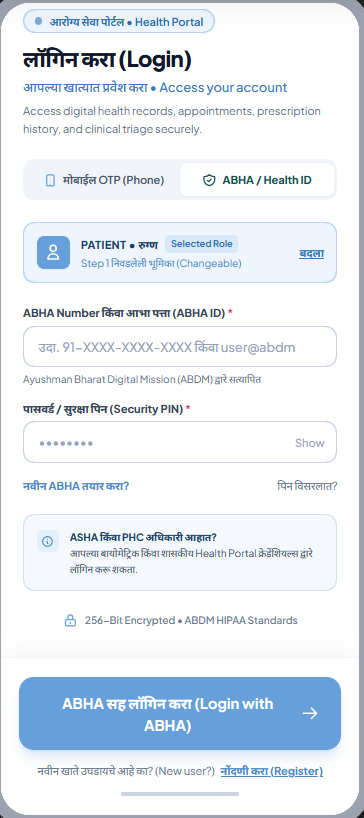
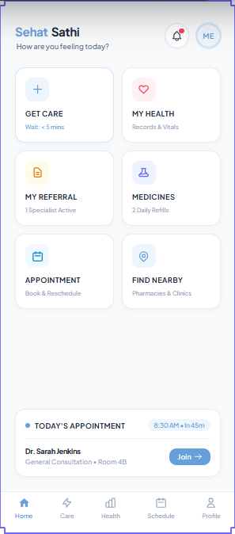

# 🩺 Sehat Sathi (सेहत साथी)

[](https://flutter.dev)
[](https://dart.dev)
[](https://riverpod.dev)
[](https://pub.dev/packages/go_router)
[](https://www.mongodb.com/)
[](https://www.postgresql.org/)

> **Sehat Sathi** is an inclusive, rural-first digital healthcare platform empowering Patients, ASHA workers, Primary Health Centers (PHCs), and District Hospitals with seamless health records, appointment tracking, AI assistance, and localized healthcare access.

---

## 📸 Screenshots & UI Showcase

| Select Language | Select Role | ABHA Health Card |
| :---: | :---: | :---: |
|  |  |  |

| Patient Dashboard | AI Chatbot | Health Records | Nearby Hospitals |
| :---: | :---: | :---: | :---: |
|  |  |  |  |

---

## 🌟 Core Features

- 🌐 **Multilingual from Ground Up**: Native support for **English**, **हिन्दी (Hindi)**, and **मराठी (Marathi)** with instant runtime switching and persistent locale preferences.
- 👥 **Role-Based Onboarding**: Tailored experiences for **Patients**, **ASHA Workers**, **Doctors / Medical Staff**, and **Facility Administrators**.
- 🆔 **ABHA Digital Health ID Integration**: Generation, viewing, and verification of Ayushman Bharat Health Accounts with live QR verification and profile syncing.
- 📊 **Dynamic Patient Dashboard**:
  - Daily schedule, upcoming doctor appointments, and test records.
  - Vital stats overview (Blood Pressure, Glucose, SpO2, Heart Rate).
  - Quick-action shortcuts to consultations, hospital locators, prescriptions, and emergency dispatch.
- 🤖 **AI Health Assistant / Chatbot**: Conversational guidance with symptom intake, health awareness tips, and vernacular query suggestions.
- 📁 **Digital Health Records**: Categorized storage and preview for lab reports, doctor prescriptions, vaccination certificates, and discharge summaries.
- 🏥 **Nearby Healthcare Facilities**: Locates nearby Primary Health Centers (PHCs), Community Health Centers (CHCs), and District Hospitals with distance, hours, emergency capabilities, and one-tap contact.
- 🔔 **Notifications & Reminders**: Real-time alerts for medicine schedules, upcoming clinic visits, and health advisory broadcasts.
- ⚙️ **Profile & Preferences**: Personalized health metrics, emergency contacts, language selection, and data privacy options.

---

## 🏗️ Project Architecture & Directory Structure

The project follows clean architecture principles, separating core infrastructure, localized strings, database connections, and domain-specific feature modules:

```text
Sehat/
├── image/                                     # Application screenshots and design mockups
├── sehat_sathi/                               # Main Flutter project
│   ├── assets/
│   │   └── fonts/                             # Custom typography
│   │       ├── Inter-*.ttf                    # Inter (Latin)
│   │       └── NotoSansDevanagari-*.ttf       # Noto Sans Devanagari (Hindi & Marathi)
│   │
│   ├── lib/
│   │   ├── main.dart                          # Application entry point
│   │   ├── app.dart                           # Root MaterialApp, theme, and router binding
│   │   │
│   │   ├── core/                              # Core foundation & cross-cutting concerns
│   │   │   ├── database/                      # Persistence & DB connectors
│   │   │   │   ├── app_database.dart          # PostgreSQL connection & query handlers
│   │   │   │   └── mongo_database.dart        # MongoDB connection & health record sync
│   │   │   ├── i18n/                          # Internationalization & Localization
│   │   │   │   ├── app_locale.dart            # Supported locales & definitions
│   │   │   │   ├── app_strings.dart           # String contract / key definitions
│   │   │   │   ├── strings_english.dart       # English translations
│   │   │   │   ├── strings_hindi.dart         # Hindi translations
│   │   │   │   ├── strings_marathi.dart       # Marathi translations
│   │   │   │   ├── locale_providers.dart      # Riverpod locale state provider
│   │   │   │   └── locale_persistence.dart    # SharedPreferences locale storage
│   │   │   ├── router/
│   │   │   │   └── app_router.dart            # GoRouter configuration & routes
│   │   │   └── theme/                         # UI Design System
│   │   │       ├── app_colors.dart            # Palettes (Emerald, Primary, Neutral)
│   │   │       ├── app_dimens.dart            # Spacing, radii, and elevations
│   │   │       ├── app_theme.dart             # ThemeData definition
│   │   │       └── app_typography.dart        # Responsive typography system
│   │   │
│   │   └── features/                          # Feature modules
│   │       ├── onboarding/                    # Step-by-step onboarding flow
│   │       │   ├── data/                      # Onboarding catalogs
│   │       │   ├── domain/                    # Role and step models
│   │       │   └── presentation/
│   │       │       ├── screens/               # Language & Role selection screens
│   │       │       └── widgets/               # Selectable role and language cards
│   │       │
│   │       ├── auth/                          # Authentication & Identity
│   │       │   ├── data/                      # Auth & Health Repositories
│   │       │   │   ├── login_repository.dart
│   │       │   │   └── user_health_repository.dart
│   │       │   └── presentation/
│   │       │       ├── screens/               # Login & Success screens
│   │       │       └── widgets/               # ABHA ID card widget & auth forms
│   │       │
│   │       └── dashboard/                     # Primary user application hub
│   │           └── presentation/
│   │               ├── providers/             # Dashboard Riverpod providers
│   │               ├── screens/
│   │               │   ├── dashboard_screen.dart        # Main dashboard
│   │               │   ├── chat_bot_screen.dart         # AI Chatbot screen
│   │               │   ├── health_records_screen.dart   # Digital records & lab reports
│   │               │   ├── nearby_page_screen.dart      # Nearby hospital locator
│   │               │   ├── notifications_page.dart      # Notifications screen
│   │               │   └── profile_settings_screen.dart # User settings & preferences
│   │               └── widgets/
│   │                   ├── dashboard_header.dart        # Greeting & notifications
│   │                   ├── dashboard_actions.dart       # Quick actions grid
│   │                   ├── dashboard_detail.dart        # Schedule & vital details
│   │                   ├── dashboard_row.dart           # Action item cards
│   │                   └── dashboard_titlebar.dart      # Status title bar
│   │
│   ├── test/                                  # Unit & Widget Test Suite
│   │   ├── widget_test.dart                   # Localization & onboarding widget tests
│   │   └── user_health_repository_test.dart   # Repository & dummy data tests
│   │
│   └── pubspec.yaml                           # Project dependencies and asset definitions
└── README.md
```

---

## 🛠️ Technology Stack & Dependencies

| Category | Technology | Purpose |
| :--- | :--- | :--- |
| **Framework** | Flutter 3.12+ (Dart 3.0+) | Cross-platform mobile, desktop, and web runtime |
| **State Management** | `flutter_riverpod` (^3.4.3) | Reactive, testable state management |
| **Routing** | `go_router` (^18.0.1) | Declarative URL-friendly route navigation |
| **Networking** | `dio` (^5.11.1) | Robust HTTP client for health API requests |
| **Local Storage** | `shared_preferences`, `flutter_secure_storage` | Offline preferences and secure token storage |
| **Databases** | `mongo_dart` (^0.10.9), `postgres` (^3.4.0) | Direct document & relational DB connections |
| **Animations** | `flutter_animate` (^4.5.2), `lottie` (^3.5.1) | Micro-interactions and transition animations |
| **Typography** | `Inter` & `NotoSansDevanagari` | High-legibility vernacular fonts |

---

## 🚀 Getting Started

### Prerequisites
- [Flutter SDK](https://docs.flutter.dev/get-started/install) (`>= 3.12.2`)
- [Dart SDK](https://dart.dev/get-dart)
- Android Studio / VS Code with Flutter extension
- An Android Device, Emulator, or Windows Desktop environment

### 1. Clone the Repository
```bash
git clone https://github.com/meetlohana/Sehat-Sathi-.git
cd Sehat-Sathi-/sehat_sathi
```

### 2. Install Dependencies
```bash
flutter pub get
```

### 3. Run the Test Suite
Ensure all unit and widget tests pass:
```bash
flutter test
```

### 4. Launch the Application
- **Run on Connected Device / Emulator:**
  ```bash
  flutter run
  ```
- **Run on Windows Desktop:**
  ```bash
  flutter run -d windows
  ```
- **Run on Chrome (Web):**
  ```bash
  flutter run -d chrome
  ```

---

## 🧪 Testing

The test suite covers onboarding transitions, localization switches, ABHA profile creation, and repository mapping:

```bash
flutter test
```

Tested scenarios include:
- Default boot in Marathi (`mr-IN`) locale
- Live language toggle between English, Hindi, and Marathi
- Multilingual role card text verification
- Locale persistence across app restarts
- `UserHealthRepository` dummy patient health profile and mock appointment records validation

---

## 📄 License

This project is licensed under the MIT License - see the LICENSE file for details.
