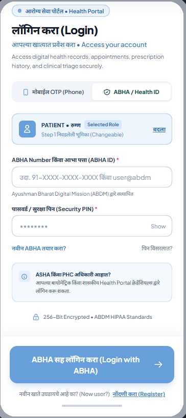
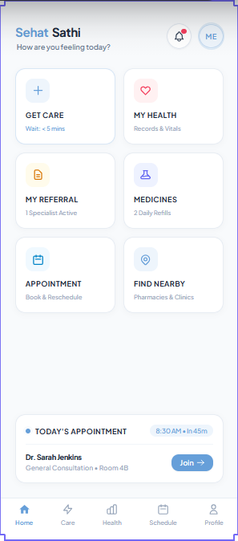

<<<<<<< HEAD
# 🩺 Sehat Sathi (सेहत साथी)

[](https://flutter.dev)
[](https://dart.dev)
[](https://riverpod.dev)
[](https://pub.dev/packages/go_router)
[](https://www.mongodb.com/)
[](https://www.postgresql.org/)

> **Sehat Sathi** is an inclusive, rural-first digital healthcare platform empowering Patients, ASHA workers, Primary Health Centers (PHCs), and District Hospitals with seamless health records, appointment tracking, AI assistance, and localized healthcare access.

---

## 📸 Screenshots & UI Showcase

| Select Language | Select Role | ABHA Health Card |
| :---: | :---: | :---: |
|  |  |  |

| Patient Dashboard | AI Chatbot | Health Records | Nearby Hospitals |
| :---: | :---: | :---: | :---: |
|  |  |  |  |

---

## 🌟 Core Features

- 🌐 **Multilingual from Ground Up**: Native support for **English**, **हिन्दी (Hindi)**, and **मराठी (Marathi)** with instant runtime switching and persistent locale preferences.
- 👥 **Role-Based Onboarding**: Tailored experiences for **Patients**, **ASHA Workers**, **Doctors / Medical Staff**, and **Facility Administrators**.
- 🆔 **ABHA Digital Health ID Integration**: Generation, viewing, and verification of Ayushman Bharat Health Accounts with live QR verification and profile syncing.
- 📊 **Dynamic Patient Dashboard**:
  - Daily schedule, upcoming doctor appointments, and test records.
  - Vital stats overview (Blood Pressure, Glucose, SpO2, Heart Rate).
  - Quick-action shortcuts to consultations, hospital locators, prescriptions, and emergency dispatch.
- 🤖 **AI Health Assistant / Chatbot**: Conversational guidance with symptom intake, health awareness tips, and vernacular query suggestions.
- 📁 **Digital Health Records**: Categorized storage and preview for lab reports, doctor prescriptions, vaccination certificates, and discharge summaries.
- 🏥 **Nearby Healthcare Facilities**: Locates nearby Primary Health Centers (PHCs), Community Health Centers (CHCs), and District Hospitals with distance, hours, emergency capabilities, and one-tap contact.
- 🔔 **Notifications & Reminders**: Real-time alerts for medicine schedules, upcoming clinic visits, and health advisory broadcasts.
- ⚙️ **Profile & Preferences**: Personalized health metrics, emergency contacts, language selection, and data privacy options.

---

## 🏗️ Project Architecture & Directory Structure

The project follows clean architecture principles, separating core infrastructure, localized strings, database connections, and domain-specific feature modules:

```text
Sehat/
├── image/                                     # Application screenshots and design mockups
├── sehat_sathi/                               # Main Flutter project
│   ├── assets/
│   │   └── fonts/                             # Custom typography
│   │       ├── Inter-*.ttf                    # Inter (Latin)
│   │       └── NotoSansDevanagari-*.ttf       # Noto Sans Devanagari (Hindi & Marathi)
│   │
│   ├── lib/
│   │   ├── main.dart                          # Application entry point
│   │   ├── app.dart                           # Root MaterialApp, theme, and router binding
│   │   │
│   │   ├── core/                              # Core foundation & cross-cutting concerns
│   │   │   ├── database/                      # Persistence & DB connectors
│   │   │   │   ├── app_database.dart          # PostgreSQL connection & query handlers
│   │   │   │   └── mongo_database.dart        # MongoDB connection & health record sync
│   │   │   ├── i18n/                          # Internationalization & Localization
│   │   │   │   ├── app_locale.dart            # Supported locales & definitions
│   │   │   │   ├── app_strings.dart           # String contract / key definitions
│   │   │   │   ├── strings_english.dart       # English translations
│   │   │   │   ├── strings_hindi.dart         # Hindi translations
│   │   │   │   ├── strings_marathi.dart       # Marathi translations
│   │   │   │   ├── locale_providers.dart      # Riverpod locale state provider
│   │   │   │   └── locale_persistence.dart    # SharedPreferences locale storage
│   │   │   ├── router/
│   │   │   │   └── app_router.dart            # GoRouter configuration & routes
│   │   │   └── theme/                         # UI Design System
│   │   │       ├── app_colors.dart            # Palettes (Emerald, Primary, Neutral)
│   │   │       ├── app_dimens.dart            # Spacing, radii, and elevations
│   │   │       ├── app_theme.dart             # ThemeData definition
│   │   │       └── app_typography.dart        # Responsive typography system
│   │   │
│   │   └── features/                          # Feature modules
│   │       ├── onboarding/                    # Step-by-step onboarding flow
│   │       │   ├── data/                      # Onboarding catalogs
│   │       │   ├── domain/                    # Role and step models
│   │       │   └── presentation/
│   │       │       ├── screens/               # Language & Role selection screens
│   │       │       └── widgets/               # Selectable role and language cards
│   │       │
│   │       ├── auth/                          # Authentication & Identity
│   │       │   ├── data/                      # Auth & Health Repositories
│   │       │   │   ├── login_repository.dart
│   │       │   │   └── user_health_repository.dart
│   │       │   └── presentation/
│   │       │       ├── screens/               # Login & Success screens
│   │       │       └── widgets/               # ABHA ID card widget & auth forms
│   │       │
│   │       └── dashboard/                     # Primary user application hub
│   │           └── presentation/
│   │               ├── providers/             # Dashboard Riverpod providers
│   │               ├── screens/
│   │               │   ├── dashboard_screen.dart        # Main dashboard
│   │               │   ├── chat_bot_screen.dart         # AI Chatbot screen
│   │               │   ├── health_records_screen.dart   # Digital records & lab reports
│   │               │   ├── nearby_page_screen.dart      # Nearby hospital locator
│   │               │   ├── notifications_page.dart      # Notifications screen
│   │               │   └── profile_settings_screen.dart # User settings & preferences
│   │               └── widgets/
│   │                   ├── dashboard_header.dart        # Greeting & notifications
│   │                   ├── dashboard_actions.dart       # Quick actions grid
│   │                   ├── dashboard_detail.dart        # Schedule & vital details
│   │                   ├── dashboard_row.dart           # Action item cards
│   │                   └── dashboard_titlebar.dart      # Status title bar
│   │
│   ├── test/                                  # Unit & Widget Test Suite
│   │   ├── widget_test.dart                   # Localization & onboarding widget tests
│   │   └── user_health_repository_test.dart   # Repository & dummy data tests
│   │
│   └── pubspec.yaml                           # Project dependencies and asset definitions
└── README.md
```

---

## 🛠️ Technology Stack & Dependencies

| Category | Technology | Purpose |
| :--- | :--- | :--- |
| **Framework** | Flutter 3.12+ (Dart 3.0+) | Cross-platform mobile, desktop, and web runtime |
| **State Management** | `flutter_riverpod` (^3.4.3) | Reactive, testable state management |
| **Routing** | `go_router` (^18.0.1) | Declarative URL-friendly route navigation |
| **Networking** | `dio` (^5.11.1) | Robust HTTP client for health API requests |
| **Local Storage** | `shared_preferences`, `flutter_secure_storage` | Offline preferences and secure token storage |
| **Databases** | `mongo_dart` (^0.10.9), `postgres` (^3.4.0) | Direct document & relational DB connections |
| **Animations** | `flutter_animate` (^4.5.2), `lottie` (^3.5.1) | Micro-interactions and transition animations |
| **Typography** | `Inter` & `NotoSansDevanagari` | High-legibility vernacular fonts |

---

## 🚀 Getting Started

### Prerequisites
- [Flutter SDK](https://docs.flutter.dev/get-started/install) (`>= 3.12.2`)
- [Dart SDK](https://dart.dev/get-dart)
- Android Studio / VS Code with Flutter extension
- An Android Device, Emulator, or Windows Desktop environment

### 1. Clone the Repository
```bash
git clone https://github.com/meetlohana/Sehat-Sathi-.git
cd Sehat-Sathi-/sehat_sathi
```

### 2. Install Dependencies
```bash
flutter pub get
```

### 3. Run the Test Suite
Ensure all unit and widget tests pass:
```bash
flutter test
```

### 4. Launch the Application
- **Run on Connected Device / Emulator:**
  ```bash
  flutter run
  ```
- **Run on Windows Desktop:**
  ```bash
  flutter run -d windows
  ```
- **Run on Chrome (Web):**
  ```bash
  flutter run -d chrome
  ```

---

## 🧪 Testing

The test suite covers onboarding transitions, localization switches, ABHA profile creation, and repository mapping:

```bash
flutter test
```

Tested scenarios include:
- Default boot in Marathi (`mr-IN`) locale
- Live language toggle between English, Hindi, and Marathi
- Multilingual role card text verification
- Locale persistence across app restarts
- `UserHealthRepository` dummy patient health profile and mock appointment records validation

---

## 📄 License

This project is licensed under the MIT License - see the LICENSE file for details.
=======
# Sehat Sathi Voice Healthcare Guide

An **accessibility + navigation** voice assistant that plugs into your EXISTING Flutter app.
It is **not** a diagnosis bot, doctor, or prescriber.

```
Patient speaks -> STT -> normalize -> local rules (fast, offline)
                                   -> or FastAPI (patient data / unknown)
 -> structured intent JSON -> whitelisted VoiceAction -> VoiceNavigationService
 -> your existing screen opens -> TTS speaks ONE short instruction
```

## Folder map
```
flutter/lib/voice_guide/        <- copy this folder into your app's lib/
  voice_guide.dart              facade: VoiceGuide.init / show / greet / reportStep / confirm
  voice_texts.dart              ALL Hindi/English strings (edit here)
  models/                       voice_intent (action whitelist), screen_context, voice_state
  services/                     speech, tts, voice_api, voice_navigation (adapter), local_intent_matcher,
                                guidance_engine, voice_local_store (SQLite prefs)
  controllers/                  voice_guide_controller (the pipeline + states)
  handlers/                     voice_intent_handler (central whitelist switch)
  widgets/                      voice_guide_button, voice_guide_overlay
flutter/pubspec_additions.yaml  dependencies to add
flutter/example/                integration_example.dart
backend/                        FastAPI service (+ tests, .env.example)
```

---
## HOW TO CONNECT THIS VOICE ASSISTANT TO MY EXISTING FLUTTER APP

### STEP 1 - Copy the module
Copy `flutter/lib/voice_guide/` into your project's `lib/` folder.

### STEP 2 - Add dependencies (pubspec.yaml)
```yaml
dependencies:
  speech_to_text: ^7.0.0
  flutter_tts: ^4.2.0
  http: ^1.2.2
  connectivity_plus: ^6.0.5
  sqflite: ^2.3.3
```
Permissions:
- **Android** `android/app/src/main/AndroidManifest.xml`
```xml
<uses-permission android:name="android.permission.RECORD_AUDIO"/>
<uses-permission android:name="android.permission.INTERNET"/>
<queries><intent><action android:name="android.speech.RecognitionService"/></intent></queries>
```
  (For a local HTTP dev server also add `android:usesCleartextTraffic="true"` to `<application>` - dev only.)
- **iOS** `Info.plist`: `NSMicrophoneUsageDescription` and `NSSpeechRecognitionUsageDescription`.

### STEP 3 - `flutter pub get`

### STEP 4 - Initialise once in `main()`
```dart
import 'voice_guide/voice_guide.dart';

final navigatorKey = GlobalKey<NavigatorState>();   // use your existing one if you have it

void main() {
  WidgetsFlutterBinding.ensureInitialized();
  VoiceGuide.init(navigatorKey: navigatorKey /* + steps 6-8 below */);
  runApp(const MyApp());
}
// In MaterialApp:
//   navigatorKey: navigatorKey,
//   navigatorObservers: [VoiceGuide.routeObserver],   // makes it screen-aware
```

### STEP 5 - Add the button to your existing HomeScreen
```dart
Scaffold(
  // ...existing UI untouched...
  floatingActionButton: const VoiceGuideButton(),
)
// Optional: or call VoiceGuide.show(context); / VoiceGuide.controller.startListening();
// Optional welcome: VoiceGuide.greet();   // "Namaste. Main Sehat Sathi Voice Guide hoon..."
```

### STEP 6 - Connect the navigation adapter to YOUR routes
```dart
VoiceGuide.init(
  navigatorKey: navigatorKey,
  routes: const VoiceRoutes(
    home: '/home', appointment: '/book-appointment', appointments: '/my-appointments',
    records: '/health-records', referral: '/referral', medicines: '/medicines',
    consultation: '/teleconsult', emergency: '/emergency',
  ),
  // Using go_router / custom navigation? Override any action:
  // navigationOverrides: { VoiceAction.openRecords: () => router.go('/records') },
);
```

### STEP 7 - Configure the FastAPI base URL
```bash
flutter run --dart-define=VOICE_API_BASE_URL=http://10.0.2.2:8000     # Android emulator
flutter run --dart-define=VOICE_API_BASE_URL=http://192.168.1.10:8000 # real phone, PC LAN IP
flutter run --dart-define=VOICE_API_BASE_URL=https://api.yourdomain.com
```
Without a reachable backend the module still handles all basic commands locally.

### STEP 8 - Configure authentication
Give the module your existing login token (the backend validates it):
```dart
VoiceGuide.init(
  navigatorKey: navigatorKey,
  tokenProvider: () async => await MyAuthStorage.readJwt(),      // your code
  patientIdProvider: () async => await MyAuthStorage.patientId(), // optional
);
```
Your login service must issue a JWT signed with the backend's `JWT_SECRET` with claims
`sub`, `role` (`patient|doctor|asha_worker|admin`) and optionally `patient_id`.
(If you use another identity provider, change `decode_token` in `app/core/security.py`.)

### STEP 9 - Run FastAPI
```bash
cd backend
python -m venv .venv && source .venv/bin/activate      # Windows: .venv\Scripts\activate
pip install -r requirements.txt
cp .env.example .env        # then set JWT_SECRET to a long random string
uvicorn app.main:app --host 0.0.0.0 --port 8000 --reload
# Docs: http://localhost:8000/docs      Tests: python -m pytest -q
# Dev token: python scripts/make_dev_token.py P123
```

### STEP 10 - Run Flutter
`flutter run --dart-define=VOICE_API_BASE_URL=...`

### STEP 11 - Test the commands
Tap **Baat Kariye** and say:

| Say | Result |
|---|---|
| "Home par jao" | Home |
| "Mujhe doctor se appointment leni hai" / "Doctor se milna hai" / "I want to book a doctor appointment" | Appointment screen + step-by-step guide |
| "Meri appointment kab hai?" | My Appointments + spoken date (needs backend + login) |
| "Meri report dikhao" / "Report dekhni hai" / "Show my health reports" | Health Records |
| "Mera referral status kya hai?" | Referral |
| "Meri medicines dikhao" | Medicines |
| "Mujhe doctor se baat karni hai" | Consultation |
| "Mujhe help chahiye" | Spoken list of commands |
| "Emergency hai" | Your Emergency screen |
| "Back jao" | Previous screen |
| "Mujhe app use karna nahi aata" | Guided tour |
| "Ab kya karna hai?" / "Yahan kya hai?" | Screen-aware help |
| "Am I having pneumonia?" | Refuses to diagnose, offers a doctor |

### Make the step-by-step booking guide work (3 tiny edits in your AppointmentScreen)
```dart
initState():          VoiceGuide.reportStep('doctor_selection');
after doctor tapped:  VoiceGuide.reportStep('date_selection');
after date tapped:    VoiceGuide.reportStep('time_selection');
after time tapped:    VoiceGuide.reportStep('confirm');
Confirm button:       VoiceGuide.confirm('Appointment confirm kar doon?', () { bookNow(); VoiceGuide.reportStep('done'); });
```
The guide only speaks these when a guided flow is active, one instruction per step.

---
## Intent -> Action mapping (the whitelist)
| Intent | Action | Flutter method (VoiceNavigationService) |
|---|---|---|
| OPEN_HOME | OPEN_HOME | openHome() |
| BOOK_APPOINTMENT | OPEN_APPOINTMENT | openAppointment() + guided flow |
| MY_APPOINTMENTS | OPEN_APPOINTMENTS / SHOW_APPOINTMENT* | openAppointments() |
| OPEN_HEALTH_RECORD | OPEN_RECORDS | openHealthRecords() |
| OPEN_REFERRAL | OPEN_REFERRAL / SHOW_REFERRAL* | openReferral() |
| MY_MEDICINES | OPEN_MEDICINES / SHOW_MEDICINES* | openMedicines() |
| START_CONSULTATION | START_CONSULTATION | openConsultation() |
| HELP | OPEN_HELP | speaks command list |
| EMERGENCY | OPEN_EMERGENCY | openEmergency() (no diagnosis) |
| GO_BACK | GO_BACK | goBack() |
| START_GUIDE | START_GUIDE | tour / guided booking |
| EXPLAIN_SCREEN, NEXT_STEP, REPEAT | same | screen-aware, on-device |
| MEDICAL_QUESTION, UNKNOWN | SPEAK_ONLY | refusal / "I can help with the app" |

\* `SHOW_*` = backend verified the user and filled the sentence with their data.
Unknown action strings are rejected in `VoiceIntent.fromJson`; the AI can never send a route name or code.

## API
`POST /api/voice/intent` (Bearer JWT optional for navigation, **required** for patient data)
```json
// request
{"text":"Meri appointment kab hai?","language":"hi","screen":"home","patient_id":"P123"}
// response
{"success":true,"intent":"MY_APPOINTMENTS","action":"SHOW_APPOINTMENT",
 "response_text":"Aapki next appointment 5 October ko hai.","language":"hi",
 "requires_confirmation":false,"requires_backend_data":true,"guide_topic":null}
```
Navigation example: `{"text":"Meri report dikhao",...}` -> `intent OPEN_HEALTH_RECORD`, `action OPEN_RECORDS`, `requires_backend_data:false`.
Errors: `401` login needed, `403` not allowed (patient asking for another patient), `422` bad input.

`GET /api/voice/guide?screen=appointment&language=hi` -> cached explanation + steps. `GET /health`.

## Environment variables (backend)
`JWT_SECRET` (required), `JWT_ALGORITHM`, `CORS_ORIGINS`, `DATABASE_URL`, `LLM_ENABLED` (default false), `APP_ENV`.
Flutter: `--dart-define=VOICE_API_BASE_URL=...`

## Security & safety summary
- JWT + RBAC; a patient can only read their own data; staff must pass a patient id (add a care-team check where marked TODO).
- The NLP layer never touches the database. `voice_service` fetches the minimum fields (a date, a count, a status) and inserts them into fixed templates. Medicine names/doses are never spoken.
- Whitelisted actions only; strict input validation; no voice recordings stored; logs contain event/intent names only (never speech text, tokens, or health data).
- Diagnosis/dose/stop-medicine questions are refused and redirected to a professional; serious-symptom phrases open the existing Emergency workflow without any diagnosis.
- Offline: Home/Help/Back/screen explanation and all navigation work locally; data questions say "Internet connection required"; nothing claims offline AI or teleconsultation.

## Extending
- New command: add a phrase rule in `local_intent_matcher.dart` + `intent_service.py`, a `VoiceAction`, a nav method, and a case in `VoiceIntentHandler`.
- New guided flow: add steps to `GuidanceEngine.flows`, texts in `voice_texts.dart`, call `reportStep` in that screen.
- Real database: implement `PatientRepository` (PostgreSQL) in `patient_repository.py`.
- Optional LLM: implement `llm_fallback` in `intent_service.py` (it may only choose a whitelisted intent and never sees patient data).
- Notifications (FCM) and WebSockets are not needed for this MVP; add them behind the same backend when required.
>>>>>>> 3d6f8dd (Voice Guidance)
